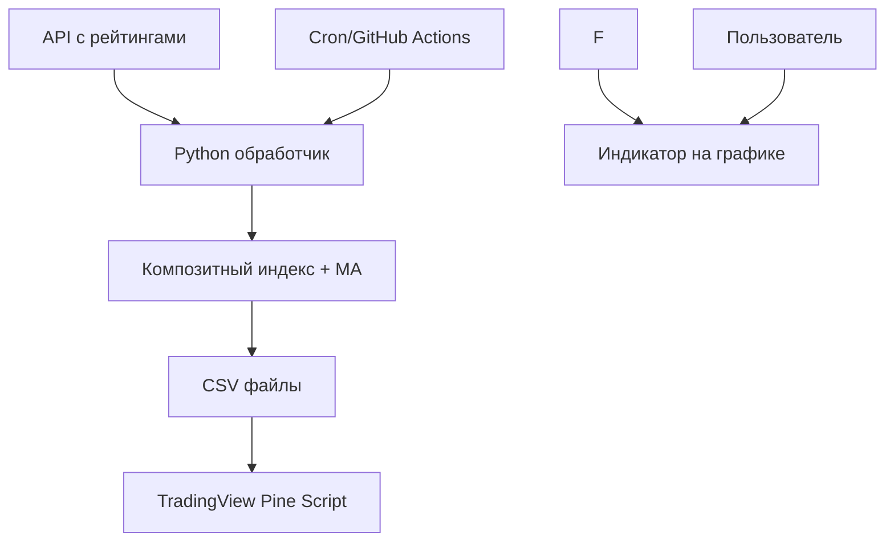

# 📊 Композитный Индекс Рейтингов для TradingView

Система автоматического создания и обновления композитного индикатора рейтингов приложений для TradingView.

## 🎯 Обзор

Этот проект позволяет:
- **Собирать данные** рейтингов приложений из разных категорий (Coin, Moon, Phantom) через ваш API
- **Рассчитывать композитный индекс** с применением скользящего среднего
- **Автоматически публиковать** индикатор с обновлёнными данными на TradingView
- **Отображать индикатор** в TradingView с возможностью сравнения с ценой BTC

## 📊 Текущая схема: встроенные данные (embedded)

## 🏗️ Архитектура



## 📋 Требования

### Системные требования
- Python 3.8+
- Git
- Bash (для автоматизации)

### Python зависимости
```bash
pip install -r requirements.txt
```

### Дополнительные требования
- **TradingView аккаунт** для публикации индикатора
- **API доступ** к данным рейтингов

## 🚀 Быстрый старт

### 1. Клонирование и настройка

```bash
git clone <your-repo-url>
cd index
cp config.env.example .env
```

### 2. Настройка конфигурации

Отредактируйте `.env` файл:

```bash
# API настройки
APP_RANKINGS_API_KEY=your_actual_api_key
API_BASE_URL=https://your-api-domain.com

# Остальные настройки...
```

### 3. Первый запуск

```bash
# Установка зависимостей
python3 -m venv venv
source venv/bin/activate
pip install -r requirements.txt

# Запуск обработки данных
chmod +x run_updater.sh
./run_updater.sh
```

### 4. Настройка автоматизации

#### Вариант A: Cron (локальный сервер)

```bash
crontab -e
```

Добавьте строку для запуска каждые 6 часов:

```bash
0 */6 * * * /path/to/your/project/run_updater.sh >> /path/to/your/project/cron.log 2>&1
```

#### Вариант B: GitHub Actions (рекомендуется)

1. Добавьте secrets в GitHub репозиторий:
   - `APP_RANKINGS_API_KEY`
   - `API_BASE_URL`

2. Workflow уже настроен в `.github/workflows/update-index.yml`

### 5. Настройка индикатора в TradingView

1. Откройте **Pine Editor** в TradingView
2. Скопируйте код из `tradingview_indicator.pine`
3. Сохраните и добавьте на график

## 📊 Структура данных

### Формат API ответа

Ваш API должен возвращать данные в формате:

```json
[
  {
    "date": "2024-01-15",
    "rank": 156.5,
    "app_name": "Example App"
  },
  // ...
]
```

### Создаваемые CSV файлы

#### `data/COMP_MA.csv`
```csv
time,open,high,low,close,volume
2024-01-15,234.5,234.5,234.5,234.5,1000
2024-01-16,236.1,236.1,236.1,236.1,1000
```

#### `data/COMP_RAW.csv`
```csv
time,open,high,low,close,volume
2024-01-15,245.2,245.2,245.2,245.2,1000
2024-01-16,241.8,241.8,241.8,241.8,1000
```

## ⚙️ Конфигурация

### Параметры Python скрипта

В `data_processor.py` можно настроить:

```python
# Эндпоинты API
endpoints = {
    'coin': '/api/rankings/coin',
    'moon': '/api/rankings/moon', 
    'phantom': '/api/rankings/phantom'
}

# Период скользящего среднего
MA_LENGTH = 30

# Максимальное значение ранга для нормализации
maxRank = 600.0
```

### Параметры Pine Script индикатора

В TradingView индикаторе доступны настройки:

- **Длина MA**: Период скользящего среднего (по умолчанию 30)
- **Показать сырой ранг**: Отображать ли исходные данные
- **Показать цену BTC**: Сравнение с BTC
- **Цвета и стили**: Настройка внешнего вида

## 🔧 Расширенная настройка

### Кастомные веса для категорий

Измените в `calculate_composite_rank()`:

```python
# Взвешенное среднее вместо простого
weights = {'coin': 0.4, 'moon': 0.3, 'phantom': 0.3}
composite_df['rank_composite'] = (
    composite_df['rank_coin'] * weights['coin'] +
    composite_df['rank_moon'] * weights['moon'] +
    composite_df['rank_phantom'] * weights['phantom']
)
```

### Дополнительные индикаторы

В Pine Script можно добавить:

```pinescript
// RSI композитного ранга
rsi_period = input.int(14, "RSI Period")
rank_rsi = ta.rsi(compMANormalized, rsi_period)
plot(rank_rsi, title="Composite RSI")

// Полосы Боллинджера
bb_length = input.int(20, "BB Length")
bb_mult = input.float(2.0, "BB Multiplier")
[bb_middle, bb_upper, bb_lower] = ta.bb(compMANormalized, bb_length, bb_mult)
```

### Уведомления

Добавьте в `data_processor.py`:

```python
import requests

def send_telegram_notification(message):
    token = os.getenv('TELEGRAM_BOT_TOKEN')
    chat_id = os.getenv('TELEGRAM_CHAT_ID')
    if token and chat_id:
        url = f"https://api.telegram.org/bot{token}/sendMessage"
        requests.post(url, data={'chat_id': chat_id, 'text': message})
```

## 🎯 Алерты в TradingView

Индикатор поддерживает алерты:

1. **Пересечение верхней зоны** - композитный ранг выше порогового значения
2. **Пересечение нижней зоны** - композитный ранг ниже порогового значения
3. **Пересечение с BTC** - корреляция с движением цены Bitcoin

Настройте алерты в TradingView: `Правый клик на график → Add Alert`

## 📈 Мониторинг и логирование

### Логи процесса

Все операции логируются в `updater.log`:

```bash
tail -f updater.log  # Просмотр логов в реальном времени
```

### Мониторинг через GitHub Actions

В GitHub репозитории: `Actions` → `Update Index` → посмотреть статус выполнения

### Статистика

Скрипт выводит статистику после обработки:

```
📊 Статистика:
   Период данных: 2024-01-01 - 2024-01-20
   Всего записей: 20
   Композитный ранг: 145.2 - 298.7
   MA(30): 156.8 - 287.1
```

## 🐛 Устранение неполадок

### Проблема: Не загружаются данные из API

**Решение:**
1. Проверьте `APP_RANKINGS_API_KEY` в `.env`
2. Убедитесь, что API доступен: `curl -H "Authorization: Bearer $API_KEY" $API_URL/api/rankings/coin`
3. Проверьте формат ответа API

## 📝 Часто задаваемые вопросы

**Q: Как часто обновляются данные в TradingView?**  
A: Для более частых обновлений нужен другой подход.

**Q: Можно ли добавить больше категорий рейтингов?**  
A: Да, измените массив `endpoints` в `data_processor.py` и логику расчета композитного индекса.

**Q: Как изменить период скользящего среднего?**  
A: Измените `MA_LENGTH` в скрипте или используйте параметр в TradingView индикаторе.

## 🤝 Вклад в проект

1. Fork репозитория
2. Создайте feature branch: `git checkout -b feature/amazing-feature`
3. Commit изменения: `git commit -m 'Add amazing feature'`
4. Push в branch: `git push origin feature/amazing-feature`
5. Создайте Pull Request

## 📄 Лицензия

Этот проект распространяется под лицензией MIT. См. файл `LICENSE` для деталей.

## 🔗 Полезные ссылки

- [TradingView Pine Script Documentation](https://www.tradingview.com/pine-script-docs/)
- [GitHub Actions Documentation](https://docs.github.com/en/actions)
- [pandas Documentation](https://pandas.pydata.org/docs/)

---

**Удачного трейдинга! 📈** 

## 🚀 Альтернативный вариант: Charting Library + UDF (профессиональное)

## Настройка переменных окружения

Скопируйте `config.env.example` в `.env` и заполните:

```bash
# Авторизация TradingView для публикации скриптов
TV_EMAIL=your_email@example.com
TV_PASSWORD=your_password
TV_SCRIPT_URL=https://www.tradingview.com/pine-editor/YOUR_SCRIPT_ID/

# Настройки браузера
TV_HEADLESS=true  # false для отображения окна браузера
```

**Важно**: Публикация скриптов теперь происходит через веб-интерфейс TradingView с помощью Firefox WebDriver, так как TradingView больше не предоставляет API для публикации.

# CBMA14 Index - Cryptocurrency Composite Index


## 🚀 Live Demo

**[Открыть CBMA14 Index Dashboard](https://username.github.io/repository-name/)**

## 📊 О проекте

**CBMA14** (Coinbase Composite Moving Average 14-day Index) - это композитный индекс криптовалютного рынка, основанный на 14-дневной скользящей средней рейтингов криптовалют с биржи Coinbase.

### ✨ Особенности

- 📈 **Красивый интерактивный график** с использованием Lightweight Charts
- 🔄 **Инвертированная шкала** - низкие значения означают сильный рынок
- ⚡ **Реальное время** - данные обновляются автоматически
- 📱 **Адаптивный дизайн** - работает на всех устройствах
- 🎨 **Современный UI** - градиенты, анимации, glassmorphism эффекты
- 📊 **Многопериодность** - поддержка MA 7, 14, 30 дней

## 🖥️ Технологии

- **Frontend**: HTML5, CSS3, JavaScript (ES6+)
- **Charts**: TradingView Lightweight Charts
- **Backend**: Python Flask (UDF Server)
- **Data**: Coinbase API, Coinglass API
- **Deployment**: GitHub Pages

## 🎯 Структура проекта

```
├── index.html              # Главная страница для GitHub Pages
├── src/                   # Исходный код проекта
│   ├── chart/            # Графический интерфейс
│   ├── data/             # Обработка данных
│   └── udf/              # UDF сервер
├── config.py             # Конфигурация
├── docker-compose.udf.yml # Docker setup
└── README.md             # Документация
```

## 🚀 Быстрый старт для GitHub Pages

### 1. Форк репозитория

Нажмите **Fork** в правом верхнем углу этой страницы.

### 2. Включите GitHub Pages

1. Перейдите в **Settings** вашего форка
2. Прокрутите до раздела **Pages**
3. В **Source** выберите **Deploy from a branch**
4. Выберите ветку **main** и папку **/ (root)**
5. Нажмите **Save**

### 3. Настройте UDF сервер (опционально)

Для получения реальных данных настройте собственный UDF сервер:

#### Вариант A: Heroku Deployment

```bash
# Клонируйте репозиторий
git clone https://github.com/your-username/cbma14-index.git
cd cbma14-index

# Создайте Heroku приложение
heroku create your-udf-server

# Установите переменные окружения
heroku config:set COINGLASS_API_KEY=your_api_key

# Деплой
git push heroku main
```

#### Вариант B: Railway Deployment

1. Подключите GitHub репозиторий к [Railway](https://railway.app)
2. Добавьте переменную `COINGLASS_API_KEY`
3. Деплой произойдет автоматически

#### Вариант C: Docker Deployment

```bash
# Локальный запуск
docker-compose -f docker-compose.udf.yml up --build

# Доступ к UDF серверу
# http://localhost:8000
```

### 4. Обновите конфигурацию

Отредактируйте `index.html` и замените:

```javascript
UDF_BASE_URL: 'https://your-udf-server.herokuapp.com'
```

На URL вашего UDF сервера.

### 5. Обновите ссылки

В `index.html` замените:

```html
<a href="https://github.com/USERNAME/REPOSITORY" class="github-link">
```

На ссылку на ваш репозиторий.

## 🛠️ Локальная разработка

### Требования

- Python 3.8+
- Docker (опционально)
- Node.js (для dev сервера)

### Установка

```bash
# Клонируйте репозиторий
git clone https://github.com/your-username/cbma14-index.git
cd cbma14-index

# Создайте виртуальное окружение
python -m venv venv
source venv/bin/activate  # Linux/Mac
# или
venv\Scripts\activate     # Windows

# Установите зависимости
pip install -r requirements.txt

# Создайте .env файл
cp .env.example .env
# Добавьте ваш COINGLASS_API_KEY

# Запустите UDF сервер
python src/udf/server.py
```

### Dev сервер для фронтенда

```bash
# Простой HTTP сервер
python -m http.server 8080

# Или с Node.js
npx serve .
```

## 🔧 Конфигурация

### UDF Сервер

Основные настройки в `config.py`:

```python
@dataclass
class UDFConfig:
    host: str = "0.0.0.0"
    port: int = 8888
    data_file: Path = Path("data/CBMA14.json")
    cbma14_symbol: str = "CBMA14"
```

### GitHub Pages

Настройки в `index.html`:

```javascript
const CONFIG = {
    UDF_BASE_URL: 'https://your-server.com',
    DEFAULT_MA_PERIOD: 14
};
```

## 📊 API Endpoints

### UDF Server

- `GET /config` - Конфигурация UDF
- `GET /history` - Исторические данные CBMA14
- `GET /btc/ohlcv` - OHLCV данные Bitcoin
- `GET /crypto/search` - Поиск криптовалют
- `GET /status` - Статус сервера

### Пример запроса

```javascript
// Получение данных CBMA14
fetch('/history?symbol=CBMA14&resolution=D&from=0&to=1640995200&ma_period=14')
  .then(response => response.json())
  .then(data => console.log(data));
```

## 🎨 Кастомизация

### Цвета и темы

Основные цвета в CSS:

```css
:root {
  --primary-color: #2962FF;
  --secondary-color: #667eea;
  --success-color: #00D4AA;
  --error-color: #FF4976;
}
```

### График

Настройки Lightweight Charts:

```javascript
chart = LightweightCharts.createChart(container, {
    layout: {
        background: { type: 'gradient', topColor: '#f8fafc', bottomColor: '#ffffff' },
        textColor: '#1a202c',
    },
    // ... другие настройки
});
```

## 🔄 Обновление данных

### Автоматическое обновление

```javascript
// Обновление каждые 5 минут
setInterval(loadData, 5 * 60 * 1000);
```

### Ручное обновление

```javascript
// Кнопка обновления
document.getElementById('refreshBtn').addEventListener('click', loadData);
```

## 📱 Мобильная версия

Проект полностью адаптирован для мобильных устройств:

- Responsive дизайн
- Touch поддержка для графика
- Оптимизированные размеры элементов
- Hamburger меню (при необходимости)

## 🚀 Деплой в продакшн

### GitHub Actions (автоматический деплой)

Создайте `.github/workflows/deploy.yml`:

```yaml
name: Deploy to GitHub Pages

on:
  push:
    branches: [ main ]

jobs:
  deploy:
    runs-on: ubuntu-latest
    steps:
    - uses: actions/checkout@v2
    
    - name: Setup Node.js
      uses: actions/setup-node@v2
      with:
        node-version: '16'
    
    - name: Deploy to GitHub Pages
      uses: peaceiris/actions-gh-pages@v3
      with:
        github_token: ${{ secrets.GITHUB_TOKEN }}
        publish_dir: ./
```

## 🐛 Устранение неполадок

### Частые проблемы

1. **CORS ошибки**
   - Убедитесь, что UDF сервер настроен правильно
   - Проверьте заголовки CORS

2. **Данные не загружаются**
   - Проверьте URL UDF сервера
   - Убедитесь, что API ключ действительный

3. **График не отображается**
   - Проверьте консоль браузера на ошибки
   - Убедитесь, что Lightweight Charts загружается

## 📈 Метрики и аналитика

### Google Analytics

Добавьте в `index.html`:

```html
<!-- Google Analytics -->
<script async src="https://www.googletagmanager.com/gtag/js?id=GA_TRACKING_ID"></script>
<script>
  window.dataLayer = window.dataLayer || [];
  function gtag(){dataLayer.push(arguments);}
  gtag('js', new Date());
  gtag('config', 'GA_TRACKING_ID');
</script>
```

## 🤝 Вклад в проект

1. Форкните репозиторий
2. Создайте ветку для новой функции
3. Внесите изменения
4. Создайте Pull Request

## 📄 Лицензия

MIT License - смотрите [LICENSE](LICENSE) файл.

## 🔗 Полезные ссылки

- [TradingView Lightweight Charts](https://tradingview.github.io/lightweight-charts/)
- [Coinbase API](https://docs.cloud.coinbase.com/)
- [GitHub Pages Documentation](https://docs.github.com/en/pages)
- [Heroku Deployment](https://devcenter.heroku.com/articles/getting-started-with-python)

## 📞 Поддержка

- 📧 Email: support@example.com
- 💬 Telegram: [@your_username](https://t.me/your_username)
- 🐛 Issues: [GitHub Issues](https://github.com/USERNAME/REPOSITORY/issues)

---

Made with ❤️ by [Your Name](https://github.com/username)
