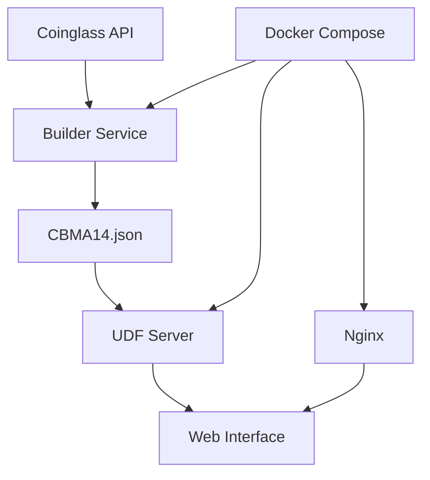

# 📊 CBMA14 Index - Cryptocurrency Composite Index


## 🚀 О проекте

**CBMA14** (Coinbase Composite Moving Average 14-day Index) - это композитный индекс криптовалютного рынка, основанный на 14-дневной скользящей средней рейтингов криптовалют с биржи Coinbase.

### ✨ Особенности

- 📈 **Интерактивные графики** с Lightweight Charts
- 🔄 **Инвертированная шкала** - низкие значения = сильный рынок
- ⚡ **Real-time данные** через Coinglass API
- 📱 **Адаптивный дизайн** для всех устройств
- 🐳 **Docker-ready** с полной автоматизацией
- 🌐 **Кроссплатформенность** (Linux, macOS, Windows)
- 🔧 **Простое развертывание** одной командой

## 🎯 Быстрый старт

### 🐳 Docker (рекомендуется)

```bash
# 1. Клонируем репозиторий
git clone <repository-url>
cd index

# 2. Настраиваем окружение
cp env.example .env
nano .env  # Добавьте COINGLASS_API_KEY

# 3. Запускаем систему
./deploy.sh              # Только API
./deploy.sh --nginx      # С веб-интерфейсом

# 4. Открываем в браузере
# http://localhost:8000 - API сервер
# http://localhost:8080 - Веб-интерфейс (с nginx)
```

### 💻 Локальная разработка

```bash
# Создаем виртуальное окружение
python -m venv venv
source venv/bin/activate

# Устанавливаем зависимости
pip install -r requirements.txt

# Настраиваем переменные окружения
cp env.example .env

# Запускаем UDF сервер
python -m src.udf.server

# Открываем http://localhost:8000
```

## 🏗️ Архитектура



### Компоненты

- **Builder Service** - Генерирует CBMA14 индекс из исходных данных
- **UDF Server** - Flask API сервер с UDF endpoints
- **Web Interface** - Интерактивный frontend с графиками
- **Nginx** - Веб-сервер и reverse proxy (опционально)

## 📊 API Endpoints

### UDF Server (порт 8000)

```bash
GET /api/status          # Статус сервера
GET /api/config          # Конфигурация UDF
GET /api/symbols         # Информация о символах
GET /api/history         # Исторические данные
GET /api/search          # Поиск символов
GET /api/crypto/ohlcv    # Данные криптовалют
```

### Примеры запросов

```bash
# Статус сервера
curl http://localhost:8000/api/status

# Данные BTC
curl "http://localhost:8000/api/crypto/ohlcv?symbol=BTCUSDT&days=30"

# История CBMA14
curl "http://localhost:8000/api/history?symbol=CBMA14&from=1640995200&to=1672531200"
```

## 🔧 Конфигурация

### Переменные окружения (.env)

```bash
# API ключи
COINGLASS_API_KEY=your_api_key_here

# Сервер
UDF_HOST=0.0.0.0
UDF_PORT=8000
UDF_DEBUG=false
FLASK_ENV=production

# Builder
BUILDER_UPDATE_INTERVAL=3600
BUILDER_MA_PERIOD=14

# Frontend
FRONTEND_API_URL=http://localhost:8000

# Docker
COMPOSE_PROJECT_NAME=cbma14
DOCKER_RESTART_POLICY=unless-stopped
```

### Кроссплатформенная конфигурация

Система автоматически определяет окружение:
- **Локальная разработка** - `localhost:8000`
- **VPS** - `http://YOUR_IP:8000`
- **GitHub Pages** - `https://YOUR_IP:8443`

## 🚀 Развертывание

### 🐳 Docker Compose

```bash
# Только API сервер
docker compose up builder udf

# С веб-интерфейсом
docker compose --profile nginx up

# В фоне
docker compose up -d

# Просмотр логов
docker compose logs -f udf

# Остановка
docker compose down
```

### 📱 GitHub Pages

1. Форкните репозиторий
2. Включите GitHub Pages в настройках
3. Обновите `FRONTEND_API_URL` в `.env`
4. Сайт будет доступен по адресу `https://username.github.io/repository-name/`

### 🖥️ VPS

```bash
# Автоматическое развертывание
./deploy.sh --nginx --clean

# Ручная настройка
scp -r . user@your-vps:/path/to/cbma14/
ssh user@your-vps
cd /path/to/cbma14
./deploy.sh --nginx
```

## 🛠️ Управление

### Основные команды

```bash
# Статус системы
docker compose ps

# Логи
docker compose logs -f

# Перезапуск
docker compose restart

# Обновление
git pull
docker compose build --no-cache
docker compose up -d

# Очистка
docker compose down --volumes --remove-orphans
docker system prune -f
```

### Мониторинг

```bash
# Статус API
curl http://localhost:8000/api/status

# Проверка данных
curl http://localhost:8000/api/crypto/ohlcv?symbol=BTCUSDT | jq

# Healthcheck
curl http://localhost:8000/api/status
```

## 🧪 Тестирование

```bash
# Полное тестирование системы
python test_system.py

# Проверка конфигурации
python -c "from config import config; print(config.udf.port)"

# Тестирование импортов
python -c "from src.udf.server import create_app; print('OK')"

# Проверка Docker
docker compose config --quiet
```

## 📁 Структура проекта

```
index/
├── config.py                 # Главная конфигурация
├── docker-compose.yml        # Docker конфигурация  
├── deploy.sh                 # Скрипт развертывания
├── env.example              # Пример переменных окружения
├── requirements.txt          # Python зависимости
├── test_system.py           # Тестовый скрипт
├── src/
│   ├── chart/
│   │   ├── index.html       # Web интерфейс
│   │   └── config.js        # Frontend конфигурация
│   ├── data/
│   │   ├── coinglass_client.py    # API клиент
│   │   ├── cbma14_provider.py     # CBMA14 провайдер
│   │   └── cbma14_calculator.py   # Калькулятор индекса
│   └── udf/
│       └── server.py        # UDF API сервер
├── builder/
│   └── build_index.py       # Генератор индекса
├── nginx/
│   └── nginx.conf          # Nginx конфигурация
├── data/                   # Данные (монтируется в Docker)
├── logs/                   # Логи
└── README.md               # Этот файл
```

## 🐛 Решение проблем

### Проблемы с портами

```bash
# Проверка занятых портов
netstat -tlnp | grep :8000

# Изменение порта
echo "UDF_PORT=8000" >> .env
docker compose up -d
```

### Проблемы с Docker

```bash
# Очистка и пересборка
docker compose down
docker system prune -f
docker compose build --no-cache
docker compose up -d
```

### Проблемы с API

```bash
# Проверка API ключа
echo $COINGLASS_API_KEY

# Тестирование API
curl -H "Authorization: Bearer $COINGLASS_API_KEY" \
     "https://open-api.coinglass.com/public/v2/funding_usd_history"
```

## 📚 Документация

- **[Руководство по рефакторингу](REFACTORING_GUIDE.md)** - Техническая документация
- **[Coinglass API](https://coinglass.github.io/API-Reference/)** - API документация
- **[Lightweight Charts](https://tradingview.github.io/lightweight-charts/)** - График библиотека
- **[Docker Compose](https://docs.docker.com/compose/)** - Docker документация

## 🤝 Участие в разработке

1. Форкните репозиторий
2. Создайте feature branch: `git checkout -b feature/amazing-feature`
3. Внесите изменения и добавьте тесты
4. Коммит: `git commit -m 'Add amazing feature'`
5. Push: `git push origin feature/amazing-feature`
6. Создайте Pull Request

## 📄 Лицензия

Этот проект распространяется под проприетарной лицензией. **Распространение только с письменного согласия автора**. См. файл [LICENSE](LICENSE) для деталей.

### Разрешено:
- ✅ Личное использование и модификация
- ✅ Внутреннее использование в организации
- ✅ Образовательные цели (некоммерческие)

### Запрещено без разрешения:
- ❌ Распространение или передача третьим лицам
- ❌ Коммерческое использование
- ❌ Публичный хостинг или SaaS
- ❌ Интеграция в коммерческие продукты

## 📞 Поддержка

Если у вас есть вопросы или проблемы:

1. Проверьте [решение проблем](#-решение-проблем)
2. Посмотрите логи: `docker compose logs -f`
3. Запустите тесты: `python test_system.py`
4. Создайте [issue](../../issues) в GitHub

---

**Удачного трейдинга! 📈**
