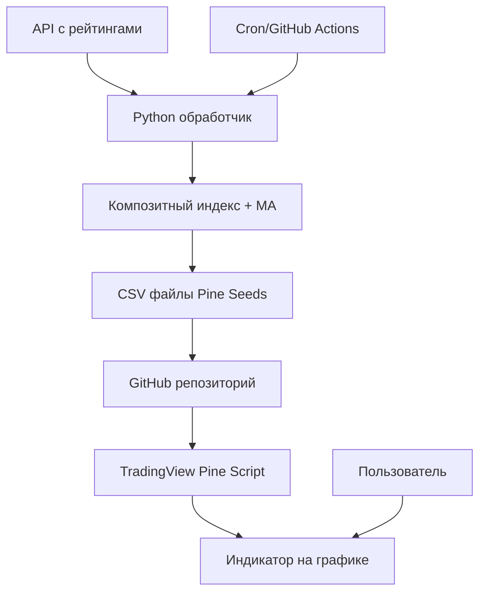

# 📊 Композитный Индекс Рейтингов для TradingView

Система автоматического создания и обновления композитного индикатора рейтингов приложений для TradingView с использованием Pine Seeds.

## 🎯 Обзор

Этот проект позволяет:
- **Собирать данные** рейтингов приложений из разных категорий (Coin, Moon, Phantom) через ваш API
- **Рассчитывать композитный индекс** с применением скользящего среднего
- **Автоматически обновлять** данные в Pine Seeds репозитории
- **Отображать индикатор** в TradingView с возможностью сравнения с ценой BTC

## 🏗️ Архитектура



## 📋 Требования

### Системные требования
- Python 3.8+
- Git
- Bash (для автоматизации)

### Python зависимости
```bash
pip install -r requirements.txt
```

### Дополнительные требования
- **GitHub аккаунт** для Pine Seeds репозитория
- **TradingView аккаунт** для публикации индикатора
- **API доступ** к данным рейтингов

## 🚀 Быстрый старт

### 1. Клонирование и настройка

```bash
git clone <your-repo-url>
cd index
cp config.env.example .env
```

### 2. Настройка конфигурации

Отредактируйте `.env` файл:

```bash
# API настройки
APP_RANKINGS_API_KEY=your_actual_api_key
API_BASE_URL=https://your-api-domain.com

# Остальные настройки...
```

### 3. Создание Pine Seeds репозитория

1. Создайте новый **публичный** репозиторий на GitHub (например, `app-ranks-seed`)
2. Клонируйте его в папку `seeds_repo/`:

```bash
git clone https://github.com/your-username/app-ranks-seed.git seeds_repo
```

3. Создайте базовую структуру:

```bash
cd seeds_repo
mkdir -p data
echo "# App Rankings Pine Seeds Data" > README.md
git add . && git commit -m "Initial commit" && git push
```

### 4. Первый запуск

```bash
# Установка зависимостей
python3 -m venv venv
source venv/bin/activate
pip install -r requirements.txt

# Запуск обработки данных
chmod +x run_updater.sh
./run_updater.sh
```

### 5. Настройка автоматизации

#### Вариант A: Cron (локальный сервер)

```bash
crontab -e
```

Добавьте строку для запуска каждые 6 часов:

```bash
0 */6 * * * /path/to/your/project/run_updater.sh >> /path/to/your/project/cron.log 2>&1
```

#### Вариант B: GitHub Actions (рекомендуется)

1. Добавьте secrets в GitHub репозиторий:
   - `APP_RANKINGS_API_KEY`
   - `API_BASE_URL`
   - `SEEDS_REPO_NAME` (например, `username/app-ranks-seed`)

2. Workflow уже настроен в `.github/workflows/update-index.yml`

### 6. Настройка индикатора в TradingView

1. Откройте **Pine Editor** в TradingView
2. Скопируйте код из `tradingview_indicator.pine`
3. Измените в коде название Seeds репозитория:

```pinescript
seedsRepo = input.string("your-username/app-ranks-seed", title="Pine Seeds Репозиторий")
```

4. Сохраните и добавьте на график

## 📊 Структура данных

### Формат API ответа

Ваш API должен возвращать данные в формате:

```json
[
  {
    "date": "2024-01-15",
    "rank": 156.5,
    "app_name": "Example App"
  },
  // ...
]
```

### Создаваемые CSV файлы

#### `data/COMP_MA.csv`
```csv
time,open,high,low,close,volume
2024-01-15,234.5,234.5,234.5,234.5,1000
2024-01-16,236.1,236.1,236.1,236.1,1000
```

#### `data/COMP_RAW.csv`
```csv
time,open,high,low,close,volume
2024-01-15,245.2,245.2,245.2,245.2,1000
2024-01-16,241.8,241.8,241.8,241.8,1000
```

## ⚙️ Конфигурация

### Параметры Python скрипта

В `data_processor.py` можно настроить:

```python
# Эндпоинты API
endpoints = {
    'coin': '/api/rankings/coin',
    'moon': '/api/rankings/moon', 
    'phantom': '/api/rankings/phantom'
}

# Период скользящего среднего
MA_LENGTH = 30

# Максимальное значение ранга для нормализации
maxRank = 600.0
```

### Параметры Pine Script индикатора

В TradingView индикаторе доступны настройки:

- **Длина MA**: Период скользящего среднего (по умолчанию 30)
- **Показать сырой ранг**: Отображать ли исходные данные
- **Показать цену BTC**: Сравнение с BTC
- **Seeds репозиторий**: Название вашего репозитория
- **Цвета и стили**: Настройка внешнего вида

## 🔧 Расширенная настройка

### Кастомные веса для категорий

Измените в `calculate_composite_rank()`:

```python
# Взвешенное среднее вместо простого
weights = {'coin': 0.4, 'moon': 0.3, 'phantom': 0.3}
composite_df['rank_composite'] = (
    composite_df['rank_coin'] * weights['coin'] +
    composite_df['rank_moon'] * weights['moon'] +
    composite_df['rank_phantom'] * weights['phantom']
)
```

### Дополнительные индикаторы

В Pine Script можно добавить:

```pinescript
// RSI композитного ранга
rsi_period = input.int(14, "RSI Period")
rank_rsi = ta.rsi(compMANormalized, rsi_period)
plot(rank_rsi, title="Composite RSI")

// Полосы Боллинджера
bb_length = input.int(20, "BB Length")
bb_mult = input.float(2.0, "BB Multiplier")
[bb_middle, bb_upper, bb_lower] = ta.bb(compMANormalized, bb_length, bb_mult)
```

### Уведомления

Добавьте в `data_processor.py`:

```python
import requests

def send_telegram_notification(message):
    token = os.getenv('TELEGRAM_BOT_TOKEN')
    chat_id = os.getenv('TELEGRAM_CHAT_ID')
    if token and chat_id:
        url = f"https://api.telegram.org/bot{token}/sendMessage"
        requests.post(url, data={'chat_id': chat_id, 'text': message})
```

## 🎯 Алерты в TradingView

Индикатор поддерживает алерты:

1. **Пересечение верхней зоны** - композитный ранг выше порогового значения
2. **Пересечение нижней зоны** - композитный ранг ниже порогового значения
3. **Пересечение с BTC** - корреляция с движением цены Bitcoin

Настройте алерты в TradingView: `Правый клик на график → Add Alert`

## 📈 Мониторинг и логирование

### Логи процесса

Все операции логируются в `updater.log`:

```bash
tail -f updater.log  # Просмотр логов в реальном времени
```

### Мониторинг через GitHub Actions

В GitHub репозитории: `Actions` → `Update Index` → посмотреть статус выполнения

### Статистика

Скрипт выводит статистику после обработки:

```
📊 Статистика:
   Период данных: 2024-01-01 - 2024-01-20
   Всего записей: 20
   Композитный ранг: 145.2 - 298.7
   MA(30): 156.8 - 287.1
```

## 🐛 Устранение неполадок

### Проблема: Не загружаются данные из API

**Решение:**
1. Проверьте `APP_RANKINGS_API_KEY` в `.env`
2. Убедитесь, что API доступен: `curl -H "Authorization: Bearer $API_KEY" $API_URL/api/rankings/coin`
3. Проверьте формат ответа API

### Проблема: TradingView не находит Seeds данные

**Решение:**
1. Убедитесь, что репозиторий **публичный**
2. Проверьте название репозитория в Pine Script
3. Дождитесь индексации (может занять до 24 часов)

### Проблема: GitHub Actions не работает

**Решение:**
1. Проверьте все secrets в настройках репозитория  
2. Убедитесь, что у GitHub токена есть права на Seeds репозиторий
3. Проверьте логи Actions

### Проблема: Данные не обновляются

**Решение:**
1. Проверьте работу cron: `crontab -l`
2. Посмотрите логи: `cat updater.log`
3. Запустите вручную: `./run_updater.sh --force`

## 📝 Часто задаваемые вопросы

**Q: Как часто обновляются данные в TradingView?**  
A: Pine Seeds обновляются раз в день (EOD). Для более частых обновлений нужен другой подход.

**Q: Можно ли добавить больше категорий рейтингов?**  
A: Да, измените массив `endpoints` в `data_processor.py` и логику расчета композитного индекса.

**Q: Как изменить период скользящего среднего?**  
A: Измените `MA_LENGTH` в скрипте или используйте параметр в TradingView индикаторе.

**Q: Можно ли использовать приватный репозиторий для Seeds?**  
A: Нет, Pine Seeds работают только с публичными репозиториями.

## 🤝 Вклад в проект

1. Fork репозитория
2. Создайте feature branch: `git checkout -b feature/amazing-feature`
3. Commit изменения: `git commit -m 'Add amazing feature'`
4. Push в branch: `git push origin feature/amazing-feature`
5. Создайте Pull Request

## 📄 Лицензия

Этот проект распространяется под лицензией MIT. См. файл `LICENSE` для деталей.

## 🔗 Полезные ссылки

- [TradingView Pine Script Documentation](https://www.tradingview.com/pine-script-docs/)
- [Pine Seeds Guide](https://www.tradingview.com/pine-script-docs/concepts/other-timeframes-and-data/)
- [GitHub Actions Documentation](https://docs.github.com/en/actions)
- [pandas Documentation](https://pandas.pydata.org/docs/)

---

**Удачного трейдинга! 📈** 